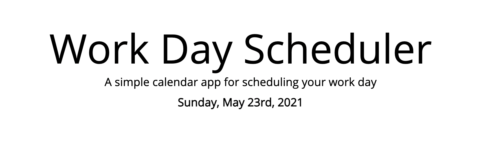
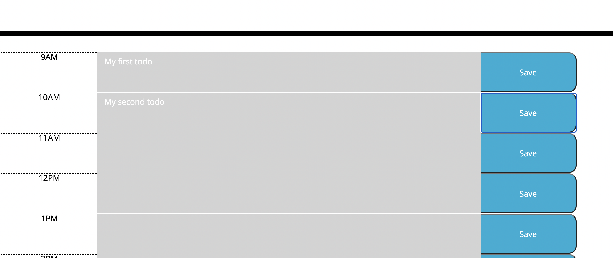
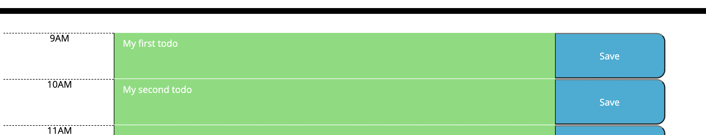

# Work Day Schedule Project

## Table of Contents

- Description
- Usage

[Description](#Description)

This project's goal is to create a work day planner that would dynamically show the current day at the top of the screen, as well as change the color of the boxes to display what time of day you are currently at.

Starting with the HTML, I created the time boxes that would have the time of day, a text box for your to-do items, and a submit button. 

I then started on the Javascript, where I used moment to pull the current day, month, and year that you are using the site and displayed them at the top of the screen. I then used a for loop to run through all of the textarea boxes and through an if, else if, and else statement, I assigned a class to the text boxes to change the color at a certain times of the day.

In the text boxes, you can write to-do items and save them by pressing the blue save button. When saved, if you refresh the page, the to-do item will remain in the box until you change it. You can save multiple items in the boxes and each one will remain in its respective box.

[Usage](#Usage)

To use this application, you can see the current day of your work day at the top under the title. If the hour hasn't passed, the boxes will display green. If the box is at the current hour, it will be red, and if the hour has passed it will be gray.

Then you can insert your own to-dos into the provided text boxes and save them by pressing the blue save button. If you refresh the page, the to-dos will still be there and are saved to your local storage.

Here is a link to the deployed site: https://morrisbianco.github.io/work-day-schedule-project/